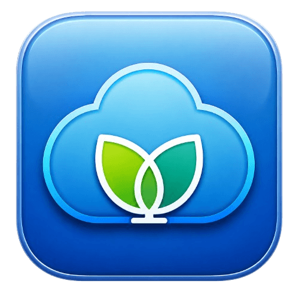

  

<h1 align="center">TungBox</h1>

  <strong>macOS 原生 sing-box 图形客户端</strong>

  
  
  
  

---

## 简介

TungBox 是 [sing-box](https://github.com/SagerNet/sing-box) 的 macOS 原生客户端，使用 Swift 6 + AppKit 构建，适配 macOS 13 及以上版本。支持订阅管理、规则分流、节点选择、TUN 模式、状态栏控制等日常代理需求。发布包内置 sing-box Core，开箱即用。

> Release 版本 **0.1.2** · 当前编译版本 **0.1.2(0070)**

## 功能

### 代理

- 系统代理开关 + TUN 模式开关，一键切换
- 规则 / 全局 / 直连三种出站模式
- 实时上传/下载速率、活跃连接数
- 流量统计（今日 / 近 7 天 / 近 30 天）

### 订阅

- 添加订阅（URL 输入 / 本地文件 / 剪贴板）、编辑、删除、刷新
- 支持 sing-box JSON（Xboard 模板）、Clash YAML（机场通用格式）
- 按订阅自动生成托管配置文件
- 订阅自动定时刷新（可配置间隔：30 分钟 - 24 小时或关闭）
- 刷新失败系统通知 + 卡片错误状态显示

### 节点

- 代理分组卡片展示（Selector / URLTest）
- 单节点 / 批量 URLTest 延迟测试
- 自动选择最快节点
- 手动切换即时生效

### 连接

- 实时连接列表（网络 / 来源 / 目标 / 规则 / 出站 / 流量）
- 按节点/域名/IP/规则关键词过滤搜索
- 右键关闭单条连接 / 关闭全部连接

### 规则

- 规则列表搜索、浏览、命中概览
- SRS 规则集下载与展开
- 自定义规则添加 / 编辑 / 启用禁用 / 删除（按订阅独立存储）
- 订阅刷新后自动合并自定义规则

### TUN

- LaunchDaemon 安装 / 卸载 / 重新安装 / 重载
- 首页启用 / 禁用无感切换
- 退出时不误停 TUN Daemon，崩溃时自动恢复

### Core 管理

- 自动检测系统 / 内置 / 自定义 Core
- 安装最新版 / 旧版测试
- 手动导入 Core
- GitHub Release 版本号自动识别
- 独立 Core 管理页

### 日志

- 运行时实时日志输出
- 按级别过滤（INFO / WARN / ERROR / DEBUG）
- 关键词搜索，显示匹配条数
- 一键复制到剪贴板 / 清空

### 其他

- 状态栏菜单：系统代理、TUN、出站模式、代理组快速切换
- 后台运行：关闭窗口最小化到状态栏，点击恢复
- 开机自启动 + 静默启动（仅状态栏）
- MD3 深浅色主题
- 左下角版本区检测 GitHub Release 应用更新
- 代理端口冲突检测
- 流量统计持久化
- 订阅配置兼容性检查
- Clash YAML 订阅识别转换
- 设置页分为常规 / Core / TUN 设置 / 规则集 / 外观

## 安装

从 [Releases](https://github.com/tongfei11/TungBox/releases/latest) 下载 `TungBox-x.x.x-macos-arm64.dmg`，挂载后将 `TungBox.app` 拖入 `/Applications`。

首次打开时，macOS Gatekeeper 可能提示"无法验证开发者"。请在 **系统设置 → 隐私与安全性** 中点击"仍要打开"。

> TungBox 内置 sing-box Core，无需额外安装。TUN 功能需要管理员密码授权安装系统服务。

## 许可

MIT License

## 致谢

- [sing-box](https://github.com/SagerNet/sing-box) — 核心代理引擎
