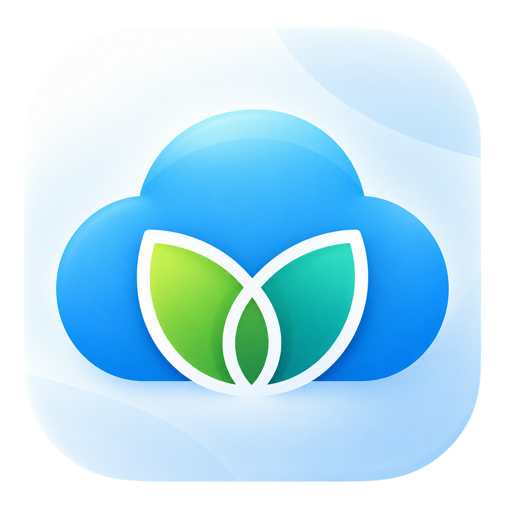
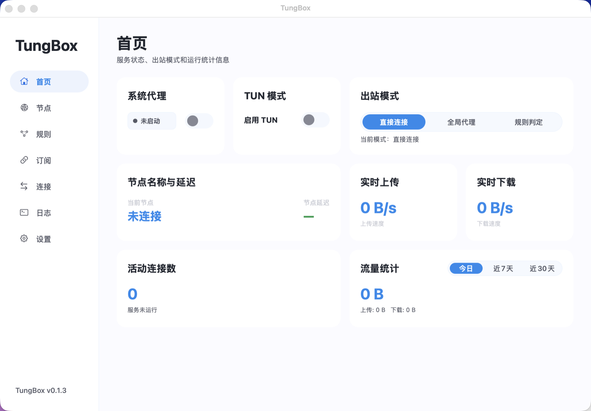

<p align="center">
  
</p>

<h1 align="center">TungBox</h1>

<p align="center">
  <strong>macOS 原生 sing-box 图形客户端</strong>
</p>

<p align="center">
  <a href="https://github.com/tongfei11/TungBox/releases/latest"></a>
  
  
  
</p>

---

<p align="center">
  
</p>

## 简介

TungBox 是 [sing-box](https://github.com/SagerNet/sing-box) 的 macOS 原生客户端，使用 Swift 6 + AppKit 构建，适配 macOS 13 及以上版本。支持订阅管理、规则分流、节点选择、TUN 模式、状态栏控制等日常代理需求。发布包内置 sing-box Core，开箱即用。

> 系统代理与 TUN 模式为两个独立开关，可同时开启；切换出站模式（直连 / 全局 / 规则）实时生效。

> Release 版本 **0.3.0** · 当前编译版本 **0.3.0(0217)**

## 开发

```bash
swift build                         # 开发构建
./script/package_app.sh arm64       # Apple Silicon 安装包
./script/package_app.sh x86_64      # Intel 安装包
./script/package_app.sh universal   # 通用安装包
```

## 安装

从 [Releases](https://github.com/tongfei11/TungBox/releases/latest) 下载安装包：Apple Silicon（M1 及后续芯片）选择 `TungBox-x.x.x-macos-arm64.dmg`，Intel Mac 选择 `TungBox-x.x.x-macos-x86_64.dmg`。挂载后将 `TungBox.app` 拖入 `/Applications`。

首次打开时，macOS Gatekeeper 可能提示"无法验证开发者"。请在 **系统设置 → 隐私与安全性** 中点击"仍要打开"。

> TungBox 内置 sing-box Core，无需额外安装。TUN 功能需要管理员密码授权安装系统服务。

## 功能

### 首页与代理

- 系统代理与 TUN 模式独立控制，可单独或同时启用
- 规则 / 全局 / 直连三种出站模式，运行中即时切换
- 展示当前订阅、当前节点、代理状态、TUN 状态与 Core 状态
- 实时上传 / 下载速率、活跃连接数和运行时状态
- 流量统计持久化，支持今日 / 近 7 天 / 近 30 天视图
- 代理端口冲突检测，运行状态异常时自动恢复

### 订阅

- 支持 URL、本地文件和剪贴板导入，可编辑、删除、手动刷新订阅
- 识别 sing-box JSON、Base64 JSON 与 Clash YAML 订阅
- Clash YAML 支持 VMess、VLESS、Trojan、Shadowsocks、Hysteria、Hysteria2、TUIC、AnyTLS、Naive、HTTP 和 SOCKS 节点转换
- 保留 TLS、uTLS、Reality、ECH、WebSocket、HTTPUpgrade、gRPC、QUIC 与 Multiplex 等节点参数
- 每个订阅使用独立配置目录、基础配置、自定义规则和规则集数据
- 切换订阅时同步切换正在运行的代理与 TUN 配置
- 自动修复旧版 sing-box 配置字段和常见兼容性问题
- 支持定时自动刷新（30 分钟至 24 小时或关闭），失败时发送系统通知并显示卡片错误状态

### 节点

- 按当前出站模式展示 Selector、URLTest 与 Fallback 代理分组
- 显示节点协议、传输方式、延迟、分组成员和实际选中节点
- 支持单节点、单分组和全部节点延迟测试，可自定义 URLTest 地址
- 自动选择使用 sing-box 分组测试结果，测速后同步两个运行 Core 的实际选择
- 自动测速间隔和切换容差可配置，减少节点来回切换
- 手动切换后界面立即响应，并在后台更新运行时、关闭旧连接和保存配置

### 连接

- 实时连接列表（网络 / 来源 / 目标 / 规则 / 出站 / 流量）
- 展示每条连接的上传 / 下载流量与瞬时速率
- 按节点、域名、IP、规则等关键词过滤搜索
- 右键关闭单条连接 / 关闭全部连接

### 规则与规则集

- 规则列表搜索、分类浏览、启用状态和命中概览
- 支持域名、域名后缀、关键字、通配符、正则、IPv4 / IPv6 CIDR、LAN、进程名、进程路径和 RULE-SET 规则
- 添加、编辑、启用、禁用和删除自定义规则，可从运行中的应用或已有规则集中选择匹配项
- 自定义规则按订阅独立保存，修改后即时应用，订阅刷新后自动重新合并
- 创建、编辑、启用、禁用和删除自定义规则集，支持预置常用 AI 服务规则
- 支持远程 SRS 规则集地址配置、下载、缓存、展开浏览、手动刷新和清空缓存
- 自动迁移旧版全局自定义规则与规则集数据到对应订阅

### DNS

- 分别配置国内 DNS 与国外 DNS，国外查询默认经当前代理节点发送
- 支持 UDP / TCP 地址、DoT、DoH、DoQ 与 DoH3 上游
- 可配置 DNS 解析策略并即时应用到当前运行配置
- Fake-IP 开关、地址段与域名排除列表
- 自定义 hosts 与系统 `/etc/hosts` 读取，可独立启用并处理同名覆盖
- DNS 配置校验、默认值恢复和旧版 Fake-IP 配置自动迁移

### TUN

- LaunchDaemon 安装 / 卸载 / 重新安装 / 重载
- 首页启用 / 禁用无感切换，日常开关不需要重复输入管理员密码
- 支持 System、GVisor 与 Mixed 协议栈，配置 MTU 和严格路由
- 支持目标 CIDR 路由排除、包含 / 排除网络接口
- 支持端点独立 NAT，改善 P2P、游戏和语音通话兼容性
- 设置修改后热重载，切换系统代理时不重启 TUN
- TUN Daemon 使用 root-owned 运行配置，日志写入受保护目录
- 启动前检查物理出口与配置，异常退出或应用重启后自动恢复运行状态

### Core 管理

- 发布包内置 sing-box 1.14.0 Core，支持 Apple Silicon 与 Intel Mac
- 自动检测系统、内置和自定义 Core，并显示实际版本
- 安装最新版 / 旧版测试
- Core 下载前置 SHA256 校验，未列入可信摘要的版本不会安装
- 手动导入 Core、打开 Core 目录和检查 GitHub Release 更新
- 更新 Core 时不打断当前正在运行的代理

### 日志

- 汇总应用、用户代理与 TUN Daemon 的实时日志
- 按级别过滤（INFO / WARN / ERROR / DEBUG）
- 关键词搜索，显示匹配条数
- 一键复制到剪贴板 / 清空

### 状态栏与系统集成

- 状态栏菜单：系统代理、TUN、出站模式、代理组快速切换
- 状态栏支持仅图标、图标 + 实时速度、仅实时速度三种样式
- 后台运行：关闭窗口最小化到状态栏，点击恢复
- 开机自启动 + 静默启动（仅状态栏）
- MD3 深浅色主题
- 自动检查 GitHub Release 应用更新，可查看版本说明并打开下载页
- 原生 macOS 通知、应用图标与 Dock / 状态栏交互
- 设置页分为常规 / Core / TUN 设置 / DNS / 规则集 / 外观

## 许可

MIT License

## 致谢

- [sing-box](https://github.com/SagerNet/sing-box) — 核心代理引擎
